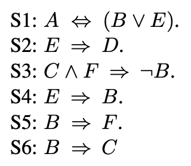
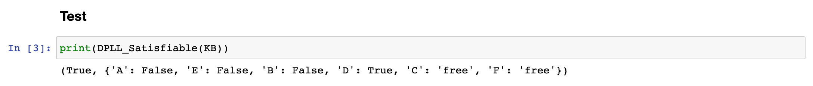

# DPLL-algorithm

- Davis–Putnam–Logemann–Loveland algorithm implemented from scratch
- It takes logical formulas in the conjunctive normal form and outputs whether they are satisfiable and, if so, a model that works

Example of use:

Knowledge base:

Output:

